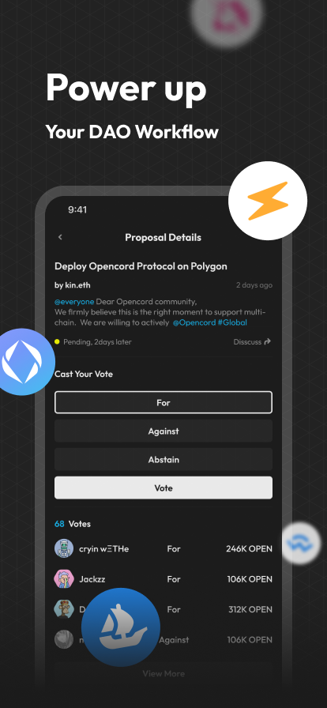

 

# 🏴‍☠️ About

Opencord is a Web 3.0 social platform built for DAOs. It is designed for the efficient connections of DAOs, the seamless connections of DApps, and the like-mindedness connections of DAO friends.

We make it easy for you to discover and manage your favorite DAOs by connecting easy-to-use DAO tools and DApps to power up your DAO workflow. Take your web3 social connections to the next level with token-gating, web3 identity, and more.

With Opencord, you get:

- Seamlessly switch between chat, voice, forum, links, and more.
- Interact directly with DApps, DAO tools, and other awesome things.
- Token-gate your communities, no clunky bots needed.
- Highlight your web3 identity with NFTs, POAPs, and more.
- Bring your own identity, data and reputation.
- ...

# ✨ Screenshots

|||   |||
|---------------|----------------|----------------|----------------|----------------|

# 🔨 How it is made?

Opencord is a web3 native social application covering all platforms.

We are committed to building a better social network with the latest blockchain technology, allowing everyone to surf the Web3 freely.

The technologies we use mainly include:

1. Use @Metamask and @WalletConnect to connect wallet to login account
2. Use @ENS as username and NFT as avatar
3. Use @Polygon’s crypto assets (e.g. ERC20, ERC721) to set up token gating
4. Use @OpenZepplin's ERC20 template as our official Token smart contract base
5. Use @IPFS to store decentralized data, such as social graphs, voting records, etc.
6. Use @Chainlink to interact with off-chain data.

|    Platform   | Built with |
|---------------|----------------|
| iOS    | Swift and SwiftUI  |
| Android   | Kotlin and Jetpack Compose   |
| Web, macOS, and Windows    | Typescript, React, Next.js, and Electron         |
| Backend    | We use Go and go-zero framework to provide secure, stable, and high-performance backend services.  |

# ☎️ Contact us

We are built for DAOs and building together with DAO friends. Come and join us to build the ideal Web3 homebase and shape the future.

🐦 Twitter: [@opencorddotxyz](https://twitter.com/opencorddotxyz)

✉️ Email: [team@opencord.xyz](mailto:team@opencord.xyz)

🔗 Website: [https://www.opencord.xyz](https://www.opencord.xyz)
